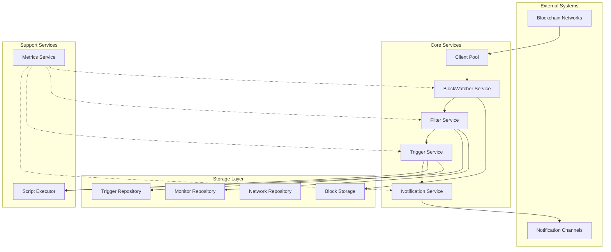
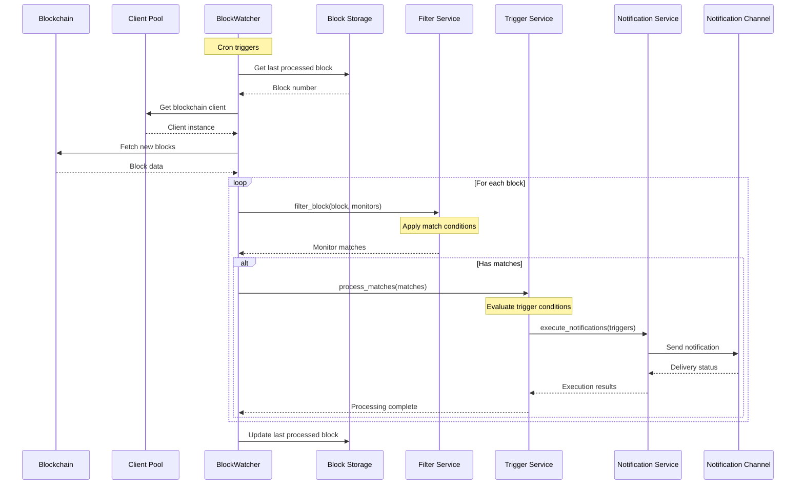
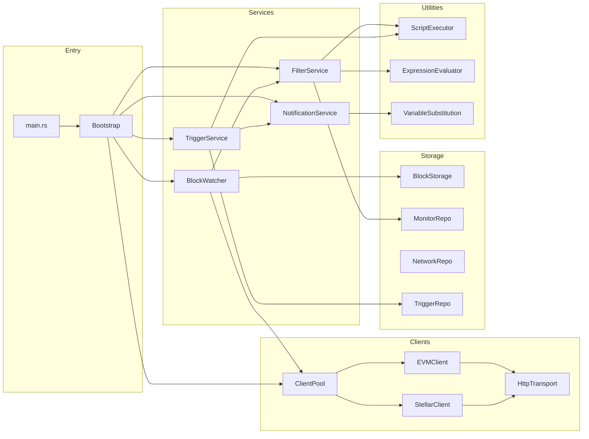
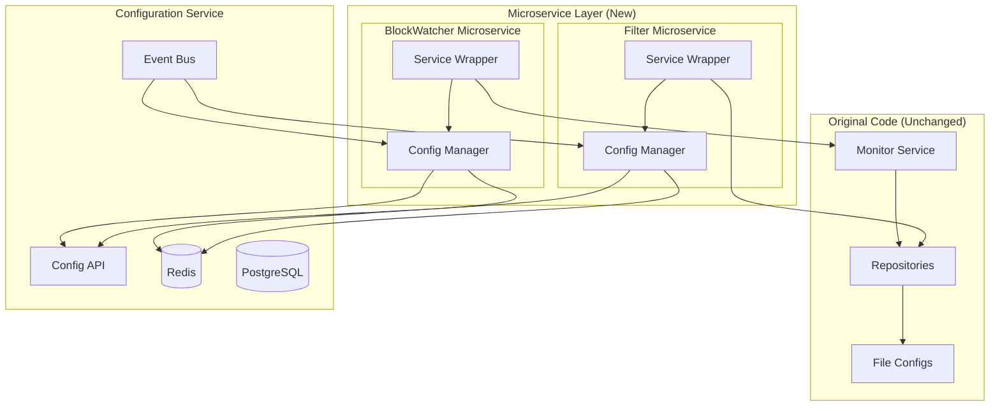

# OpenZeppelin Monitor Architecture Analysis

## Table of Contents

1. [Overview](#overview)
2. [Core Components](#core-components)
3. [Architecture Diagrams](#architecture-diagrams)
4. [Component Details](#component-details)
5. [Data Flow](#data-flow)
6. [Microservices Extraction Strategy](#microservices-extraction-strategy)
7. [Configuration Management](#configuration-management)
8. [Implementation Plan](#implementation-plan)

## Overview

OpenZeppelin Monitor is a blockchain monitoring service that watches on-chain activities and triggers notifications based on configurable conditions. It supports EVM-compatible networks and Stellar.

### Architecture Characteristics

- **Modular**: Components communicate through well-defined interfaces
- **Pipeline-based**: Data flows through discrete processing stages
- **Extensible**: New blockchains, filters, and notification channels can be added
- **Fault tolerant**: Built-in retry mechanisms and error handling
- **Performant**: Concurrent processing with connection pooling

## Core Components

The system has 12 components that can be extracted into independent services:

1. **BlockWatcher Service** - Polls blockchains for new blocks
2. **Block Storage** - Persists last processed block number
3. **Client Pool** - Manages blockchain RPC connections
4. **Filter Service** - Evaluates monitor conditions against block data
5. **Trigger Service** - Executes actions when conditions match
6. **Notification Service** - Sends alerts through various channels
7. **Monitor Repository** - Stores monitor configurations
8. **Network Repository** - Stores network configurations
9. **Trigger Repository** - Stores trigger configurations
10. **Script Executor** - Runs custom JavaScript/Python/Bash scripts
11. **Metrics Service** - Exposes Prometheus metrics
12. **Configuration Service** - Manages dynamic multi-tenant configurations

## Architecture Diagrams

### Current System Architecture



### Block Processing Flow



### Component Dependencies



## Component Details

### 1. BlockWatcher Service

**Location**: `src/services/blockwatcher/`

Polls blockchains on cron schedules and coordinates the processing pipeline. Uses channels for concurrent processing (up to 32 blocks) with automatic retry on failures.

**Key interfaces**:

- `start()` - Begins monitoring networks
- `process_block()` - Handles individual blocks
- `shutdown()` - Graceful shutdown

> **Implementation Details**: See [BlockWatcher Service Wrapper](./MICROSERVICES_IMPLEMENTATION_CHECKLIST.md#11-blockwatcher-service-wrapper)

### 2. Client Pool

**Location**: `src/services/blockchain/`

Thread-safe pool of blockchain clients with lazy initialization. Handles connection failover and endpoint rotation when RPCs return errors.

**Key interfaces**:

- `get_client(network_id)` - Returns client for network
- `invalidate(network_id)` - Forces reconnection

> **Implementation Details**: See [Client Pool Service Wrapper](./MICROSERVICES_IMPLEMENTATION_CHECKLIST.md#12-client-pool-service-wrapper)

### 3. Filter Service

**Location**: `src/services/filter/`

Evaluates monitor conditions against blockchain data. Supports expression-based filtering and custom scripts.

**Key interfaces**:

- `filter_block(block, monitors)` - Returns matches
- `evaluate_expression(expr, context)` - Evaluates conditions

> **Implementation Details**: See [Filter Service Wrapper](./MICROSERVICES_IMPLEMENTATION_CHECKLIST.md#13-filter-service-wrapper)

### 4. Trigger Service

**Location**: `src/services/trigger/`

Executes actions when monitor conditions match. Supports parallel execution with timeouts.

**Key interfaces**:

- `process_matches(matches)` - Evaluates triggers
- `execute_script(script, context)` - Runs custom scripts

> **Implementation Details**: See [Trigger Service Wrapper](./MICROSERVICES_IMPLEMENTATION_CHECKLIST.md#14-trigger-service-wrapper)

### 5. Notification Service

**Location**: `src/services/notification/`

Sends notifications through multiple channels (Slack, Email, Discord, Telegram, Webhook, Script). Handles template variable substitution and retry policies.

**Key interfaces**:

- `send_notification(trigger, context)` - Sends alert
- `substitute_variables(template, data)` - Fills templates

> **Implementation Details**: See [Notification Service Wrapper](./MICROSERVICES_IMPLEMENTATION_CHECKLIST.md#15-notification-service-wrapper)

### 6. Storage Components

**Locations**: `src/repositories/`, `src/services/blockwatcher/storage.rs`

Repositories load configurations from JSON files at startup. Block storage persists the last processed block number per network.

## Data Flow

1. **Block Discovery**: Cron → BlockWatcher → BlockStorage → Client Pool → Blockchain RPC
2. **Filtering**: Block Data → Filter Service → Expression Evaluator → Matches
3. **Triggering**: Matches → Trigger Service → Script Executor → Results
4. **Notification**: Results → Notification Service → Template Engine → Channels
5. **Persistence**: Processed Block → Block Storage

## Microservices Extraction Strategy

### Phase 1: Service Extraction

Extract services by creating API boundaries around existing components:

1. **BlockWatcher Service**
   - Expose gRPC/REST API for block streaming
   - Publish blocks to message queue (Kafka/RabbitMQ)
   - Package as Docker container
   - See [BlockWatcher Service Wrapper](./MICROSERVICES_IMPLEMENTATION_CHECKLIST.md#11-blockwatcher-service-wrapper)

2. **Client Pool Service**
   - Create RPC proxy with connection management
   - REST API for health checks and metrics
   - Support dynamic endpoint configuration
   - See [Client Pool Service Wrapper](./MICROSERVICES_IMPLEMENTATION_CHECKLIST.md#12-client-pool-service-wrapper)

3. **Filter Service**
   - Stateless REST API for filter evaluation
   - Input: block data + monitor conditions
   - Output: matches
   - See [Filter Service Wrapper](./MICROSERVICES_IMPLEMENTATION_CHECKLIST.md#13-filter-service-wrapper)

### Phase 2: Communication Infrastructure

1. **Message Bus**: Kafka for event streaming between services
2. **Service Discovery**: Consul or Kubernetes DNS
3. **API Gateway**: Kong or Envoy for external access
4. **Tracing**: OpenTelemetry for distributed tracing

### Phase 3: Configuration Management

Build a separate Configuration Service for dynamic updates (see next section).

### Phase 4: Deployment

1. **Containerization**: Multi-stage Docker builds
2. **Orchestration**: Kubernetes with Helm charts
3. **Scaling**: Horizontal pod autoscaling based on metrics

## Configuration Management

### Current State

Configurations are loaded from files at startup:

- Monitor configs: `config/monitors/*.json`
- Network configs: `config/networks/*.json`
- Trigger configs: `config/triggers/*.json`
- Scripts: `config/filters/*.{js,py,sh}`

### Multi-Tenant Configuration Service

To support multiple tenants without service restarts, we'll add configuration management at the microservice layer without modifying the original code.

> **Implementation Guide**: See [Week 3: Configuration Service](./MICROSERVICES_IMPLEMENTATION_CHECKLIST.md#week-3-configuration-service) for detailed implementation steps

#### Architecture



#### How It Works

Each microservice wraps the original service and adds configuration management:

```rust
// microservices/blockwatcher/src/main.rs
pub struct BlockWatcherMicroservice {
    // Original service (unchanged)
    core: BlockWatcherService,
    // Configuration management layer
    config_mgr: ConfigManager,
}

impl BlockWatcherMicroservice {
    async fn run(&mut self) {
        loop {
            // Check for config updates
            if let Some(update) = self.config_mgr.poll_updates().await {
                self.apply_update(update);
            }
            
            // Run original logic
            self.core.process_next_block().await;
        }
    }
    
    fn apply_update(&mut self, update: ConfigUpdate) {
        match update {
            ConfigUpdate::MonitorAdded(m) => self.core.add_monitor(m),
            ConfigUpdate::MonitorUpdated(m) => self.core.update_monitor(m),
            ConfigUpdate::MonitorRemoved(id) => self.core.remove_monitor(id),
        }
    }
}
```

#### Redis Schema

```rust
# Configuration storage
tenant:{tenant_id}:monitor:{id}     # Monitor config
tenant:{tenant_id}:network:{id}     # Network config
tenant:{tenant_id}:trigger:{id}     # Trigger config

# Version tracking
config:version:{type}:{id}          # Version history

# Change notifications
channel:config:{tenant_id}          # Pub/sub channel
```

#### Benefits

1. Original code remains unchanged
2. Each microservice handles its own multi-tenancy
3. Configuration updates without restarts
4. Gradual migration (file configs → dynamic configs)
5. Easy rollback (just redeploy without wrapper)

## Implementation Plan

> **📋 Detailed Implementation Checklist**: For a comprehensive breakdown of all tasks with nested checklists, see [MICROSERVICES_IMPLEMENTATION_CHECKLIST.md](./MICROSERVICES_IMPLEMENTATION_CHECKLIST.md)

### Week 1-2: Service Extraction

- [ ] Create service wrappers (not modifying original code)
  - See [Service Wrappers Section](./MICROSERVICES_IMPLEMENTATION_CHECKLIST.md#1-create-service-wrappers-not-modifying-original-code)
- [ ] Define APIs that mirror existing interfaces
  - See [API Definitions Section](./MICROSERVICES_IMPLEMENTATION_CHECKLIST.md#2-define-apis-that-mirror-existing-interfaces)
- [ ] Set up development environment
  - See [Development Environment Section](./MICROSERVICES_IMPLEMENTATION_CHECKLIST.md#3-set-up-development-environment)
- [ ] Keep monolith running
  - See [Monolith Compatibility Section](./MICROSERVICES_IMPLEMENTATION_CHECKLIST.md#4-keep-monolith-running)

### Week 3: Configuration Service

- [ ] Build Configuration Service with Redis + PostgreSQL
  - See [Configuration Service Structure](./MICROSERVICES_IMPLEMENTATION_CHECKLIST.md#1-build-configuration-service-with-redis--postgresql)
- [ ] Create REST/gRPC API
  - See [API Implementation](./MICROSERVICES_IMPLEMENTATION_CHECKLIST.md#2-create-restgrpc-api)
- [ ] Implement configuration managers for each wrapper
  - See [Configuration Managers](./MICROSERVICES_IMPLEMENTATION_CHECKLIST.md#3-implement-configuration-managers-for-each-wrapper)
- [ ] Set up pub/sub for change events
  - See [Pub/Sub Implementation](./MICROSERVICES_IMPLEMENTATION_CHECKLIST.md#4-set-up-pubsub-for-change-events)

### Week 4: Integration

- [ ] Connect microservices to Configuration Service
  - See [Service Integration](./MICROSERVICES_IMPLEMENTATION_CHECKLIST.md#1-connect-microservices-to-configuration-service)
- [ ] Implement service discovery
  - See [Service Discovery](./MICROSERVICES_IMPLEMENTATION_CHECKLIST.md#2-implement-service-discovery)
- [ ] Create API gateway
  - See [API Gateway](./MICROSERVICES_IMPLEMENTATION_CHECKLIST.md#3-create-api-gateway)
- [ ] Test end-to-end flow
  - See [Testing](./MICROSERVICES_IMPLEMENTATION_CHECKLIST.md#4-test-end-to-end-flow)

### Week 5: Multi-Tenant Features

- [ ] Add tenant isolation in configuration managers
  - See [Tenant Isolation](./MICROSERVICES_IMPLEMENTATION_CHECKLIST.md#1-add-tenant-isolation-in-configuration-managers)
- [ ] Implement config versioning
  - See [Config Versioning](./MICROSERVICES_IMPLEMENTATION_CHECKLIST.md#2-implement-config-versioning)
- [ ] Performance testing
  - See [Performance Testing](./MICROSERVICES_IMPLEMENTATION_CHECKLIST.md#3-performance-testing)
- [ ] Security audit
  - See [Security Audit](./MICROSERVICES_IMPLEMENTATION_CHECKLIST.md#4-security-audit)

### Week 6: Deployment

- [ ] Deploy Configuration Service
  - See [Configuration Service Deployment](./MICROSERVICES_IMPLEMENTATION_CHECKLIST.md#1-deploy-configuration-service)
- [ ] Deploy microservices alongside monolith
  - See [Microservices Deployment](./MICROSERVICES_IMPLEMENTATION_CHECKLIST.md#2-deploy-microservices-alongside-monolith)
- [ ] A/B test both systems
  - See [A/B Testing](./MICROSERVICES_IMPLEMENTATION_CHECKLIST.md#3-ab-test-both-systems)
- [ ] Create migration tools
  - See [Migration Tools](./MICROSERVICES_IMPLEMENTATION_CHECKLIST.md#4-create-migration-tools)
- [ ] Documentation
  - See [Documentation](./MICROSERVICES_IMPLEMENTATION_CHECKLIST.md#5-documentation)

### Success Metrics

- No changes to original codebase
- <10% performance overhead
- 99.9% uptime
- Zero-downtime config updates
- Sub-second config propagation

> **Validation Checklist**: See [Success Criteria Validation](./MICROSERVICES_IMPLEMENTATION_CHECKLIST.md#success-criteria-validation)

### Risk Mitigation

1. **Performance**: Add caching at each layer
2. **Reliability**: Circuit breakers for service calls
3. **Security**: mTLS between services
4. **Monitoring**: Distributed tracing with OpenTelemetry
5. **Rollback**: Feature flags for gradual rollout

## Conclusion

The OpenZeppelin Monitor's modular architecture makes it well-suited for microservices extraction. By wrapping services instead of modifying them, we can add multi-tenant configuration management while keeping the original code intact. This approach allows parallel development, gradual migration, and easy rollback if needed.
