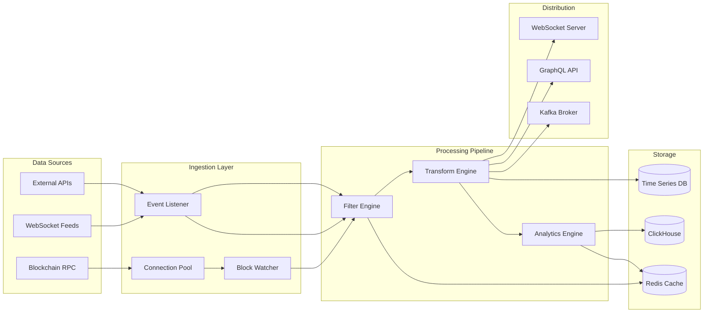
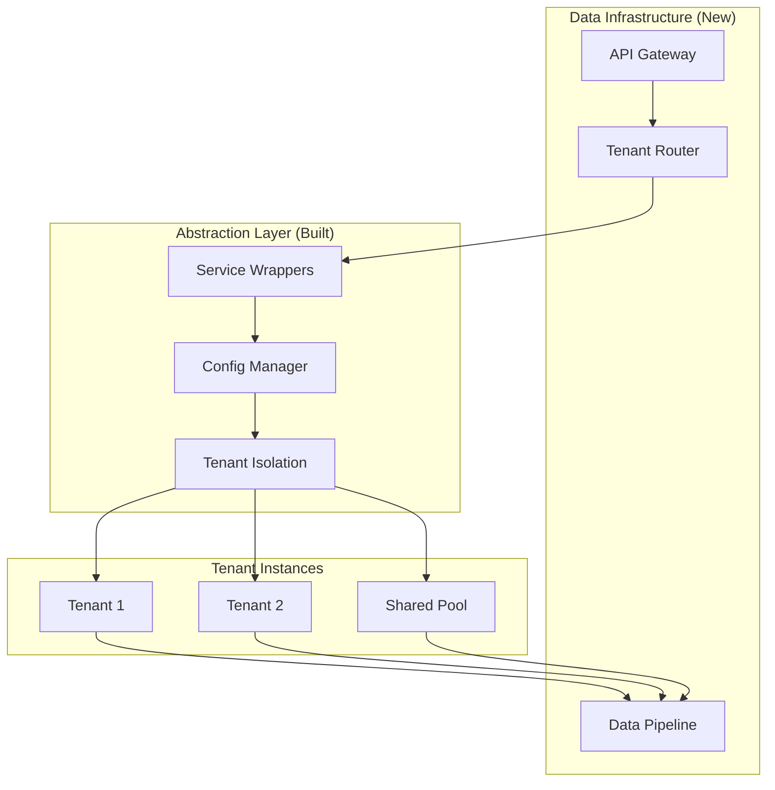
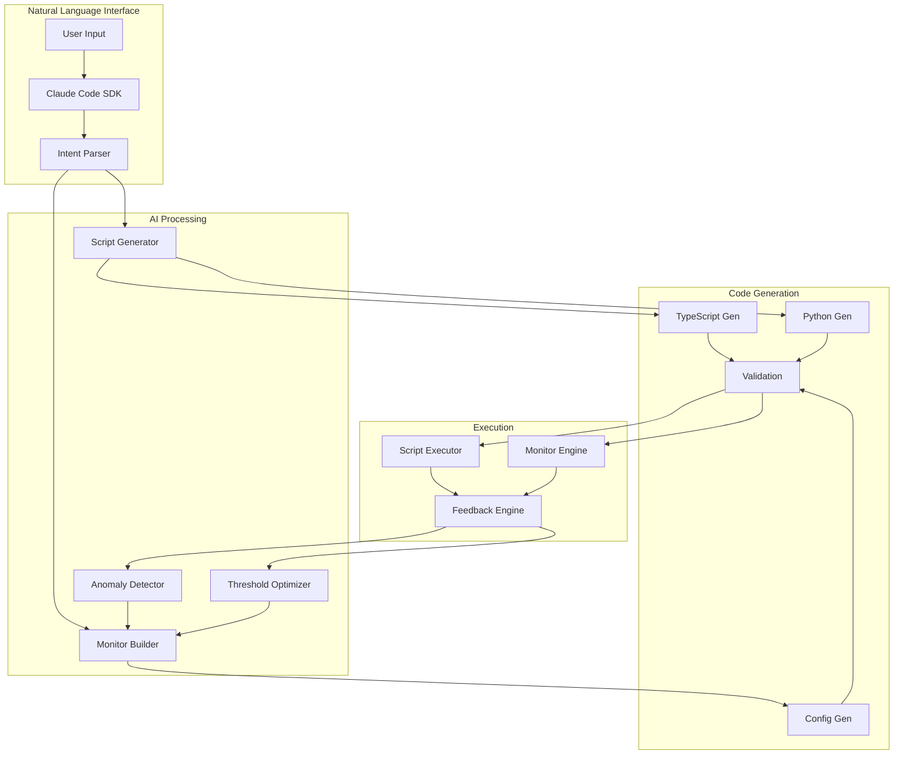
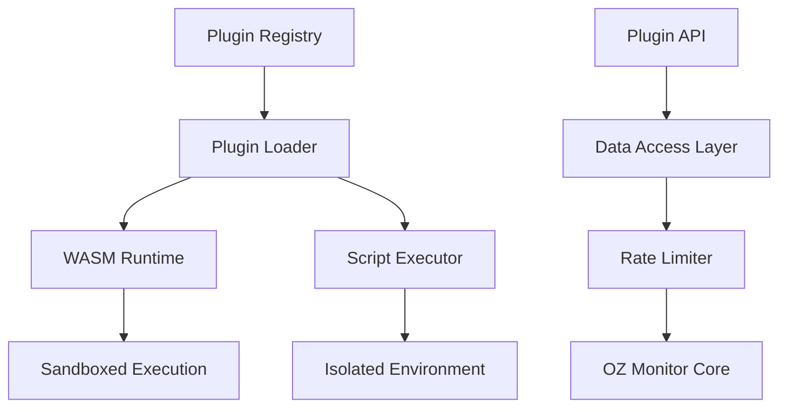

# Blip0: Real-Time Blockchain Data Infrastructure Platform - Product Roadmap

## Executive Summary

Blip0 transforms OpenZeppelin Monitor from a notification tool into comprehensive real-time blockchain data infrastructure. This document outlines our agile product roadmap for building data feeds, analytics, and AI-powered tools on top of the OZ Monitor foundation. Each sprint delivers working features that protocols, dapps, and users can immediately utilize.

## Vision: Beyond Monitoring

While OpenZeppelin sees this as a monitor, we see **real-time blockchain data infrastructure**. Our abstraction layer unlocks:

- **Data Feeds**: Stream filtered blockchain events to any application
- **Analytics Engine**: Real-time insights and pattern detection
- **AI Automation**: Natural language interfaces and script generation
- **Composable Logic**: Build complex workflows from simple components
- **Multi-Tenant Platform**: Serve thousands of users without compromising performance

Every feature is designed to be used standalone OR combined with others for exponential value.

## Scoring Methodology

- **Uniqueness (1-10)**: How differentiated is this from existing solutions?
- **Innovation (1-10)**: How novel or cutting-edge is the approach?
- **Feasibility (1-10)**: How easily can this be built given our abstraction layer? (Multi-tenant features now score 9-10)
- **Impact (1-10)**: Immediate value to users and potential for adoption
- **Market Gap (1-10)**: How underserved is this need? (10 = completely unaddressed)
- **Composability (1-10)**: How well does this combine with other features? (NEW)
- **Weighted Score**: (Uniqueness × 0.15) + (Innovation × 0.15) + (Feasibility × 0.20) + (Impact × 0.20) + (Market Gap × 0.15) + (Composability × 0.15)

## Comprehensive Extension Ideas Analysis

| Category | Extension Name | Description | Uniqueness | Innovation | Feasibility | Impact | Market Gap | Composability | Weighted Score | Priority |
|----------|----------------|-------------|------------|------------|-------------|--------|------------|---------------|----------------|----------|
| **Data Infrastructure** | | | | | | | | | | |
| Data | Real-Time Data Feed API | WebSocket/gRPC streams for filtered blockchain events | 9 | 8 | 9 | 10 | 9 | 10 | 9.00 | CRITICAL |
| Data | Composable Analytics Engine | Combine data streams for complex insights | 8 | 9 | 8 | 9 | 8 | 10 | 8.80 | CRITICAL |
| Data | Historical Data Lake | Query past events with millisecond precision | 7 | 6 | 8 | 9 | 7 | 8 | 7.55 | HIGH |
| **AI-Powered Development** | | | | | | | | | | |
| AI/Dev | AI Script Generator | Claude Code SDK for natural language script creation | 9 | 10 | 8 | 10 | 9 | 9 | 9.20 | CRITICAL |
| AI/Dev | Developer Workflow Automation | Auto-generate monitors from code comments | 8 | 9 | 8 | 9 | 8 | 8 | 8.65 | CRITICAL |
| **Multi-Tenant Architecture** | | | | | | | | | | |
| Infrastructure | Tenant Isolation Engine | Sandboxed monitoring environments with resource quotas and performance isolation | 7 | 8 | 10 | 9 | 8 | 9 | 8.55 | CRITICAL |
| Infrastructure | White-Label API Gateway | Enable monitoring-as-a-service offerings with custom branding | 8 | 7 | 10 | 8 | 9 | 8 | 8.30 | HIGH |
| Infrastructure | Federated Monitor Networks | Cross-tenant alert sharing for collaborative monitoring | 9 | 9 | 9 | 7 | 10 | 9 | 8.65 | CRITICAL |
| Infrastructure | Enterprise SSO Integration | SAML/OAuth2 + Stellar federated addresses for auth | 5 | 4 | 10 | 8 | 6 | 5 | 6.40 | REMOVED |
| **AI-Powered Analytics** | | | | | | | | | | |
| AI/ML | Natural Language Monitor Builder | "Alert me when..." conversational interface | 9 | 9 | 8 | 9 | 9 | 10 | 8.90 | CRITICAL |
| AI/ML | Anomaly Detection Engine | ML-based unusual pattern detection | 7 | 8 | 8 | 9 | 7 | 9 | 8.10 | HIGH |
| AI/ML | Predictive Alert System | Forecast issues based on historical patterns | 8 | 9 | 7 | 8 | 8 | 8 | 8.00 | HIGH |
| AI/ML | Smart Threshold Optimizer | Self-adjusting alert thresholds based on feedback | 8 | 8 | 9 | 7 | 9 | 7 | 8.00 | HIGH |
| **User Interface** | | | | | | | | | | |
| UI/UX | Visual Monitor Designer | Drag-and-drop monitor building interface | 6 | 6 | 8 | 9 | 7 | 8 | 7.50 | HIGH |
| UI/UX | Mobile Command Center | Native iOS/Android apps with push notifications | 5 | 5 | 7 | 8 | 6 | 6 | 6.20 | LOW |
| UI/UX | AR Network Visualizer | Augmented reality dashboard for network activity | 10 | 10 | 3 | 6 | 10 | 4 | 6.90 | REMOVED |
| UI/UX | Template Marketplace | Share/monetize monitor configurations | 8 | 7 | 9 | 8 | 9 | 9 | 8.30 | HIGH |
| **Developer Tools** | | | | | | | | | | |
| DevTools | Monitor-as-Code Framework | Declarative monitor definitions in code | 8 | 8 | 9 | 9 | 8 | 10 | 8.85 | CRITICAL |
| DevTools | Testing & Simulation Suite | Historical data testing and synthetic transactions | 7 | 7 | 8 | 9 | 8 | 9 | 8.15 | HIGH |
| DevTools | Multi-Language SDKs | Python, JS, Go, Rust client libraries | 4 | 4 | 9 | 9 | 5 | 7 | 6.60 | MEDIUM |
| DevTools | GraphQL API Layer | Flexible data querying for monitor results | 6 | 6 | 8 | 8 | 6 | 8 | 7.10 | HIGH |
| DevTools | WASM Plugin Runtime | Sandboxed custom logic execution | 9 | 9 | 6 | 7 | 10 | 10 | 8.35 | CRITICAL |
| **Compliance & Risk** | | | | | | | | | | |
| Compliance | KYC/AML Monitor Suite | Pre-built suspicious activity monitors | 6 | 5 | 8 | 9 | 6 | 7 | 7.00 | HIGH |
| Compliance | Jurisdiction-Aware Rules | Geographic regulation compliance | 8 | 7 | 7 | 8 | 8 | 8 | 7.75 | HIGH |
| Compliance | Automated Regulatory Reports | MiCA, SEC report generation | 7 | 6 | 7 | 9 | 7 | 6 | 7.05 | HIGH |
| Risk | Address Reputation System | Behavioral scoring for addresses | 7 | 7 | 8 | 8 | 7 | 8 | 7.60 | HIGH |
| Risk | Path Payment Risk Analyzer | Identify risky payment paths on Stellar | 9 | 8 | 7 | 8 | 10 | 9 | 8.40 | CRITICAL |
| **Stellar-Specific** | | | | | | | | | | |
| Stellar | Path Payment Optimizer | Real-time optimal path suggestions | 10 | 9 | 7 | 9 | 10 | 9 | 8.95 | CRITICAL |
| Stellar | Asset Issuer Dashboard | Comprehensive issuer monitoring tools | 9 | 8 | 8 | 9 | 9 | 8 | 8.55 | CRITICAL |
| Stellar | Federated Address Monitor | Track federated namespace activities | 10 | 8 | 8 | 7 | 10 | 7 | 8.30 | HIGH |
| Stellar | Claimable Balance Tracker | Monitor and alert on unclaimed balances | 9 | 7 | 9 | 7 | 10 | 7 | 8.00 | HIGH |
| Stellar | Soroban Contract Suite | Advanced smart contract monitoring | 9 | 9 | 7 | 9 | 9 | 9 | 8.70 | CRITICAL |
| **Plugin Ecosystem** | | | | | | | | | | |
| Plugins | Plugin Marketplace | Community-built extensions | 8 | 7 | 7 | 9 | 8 | 9 | 8.05 | HIGH |
| Plugins | Custom Filter Registry | Shareable filter logic | 7 | 6 | 9 | 8 | 8 | 8 | 7.70 | HIGH |
| Plugins | Data Enrichment APIs | Add off-chain context to monitoring | 8 | 7 | 8 | 8 | 8 | 8 | 7.90 | HIGH |
| **Integrations** | | | | | | | | | | |
| Integration | DeFi Protocol Connectors | Monitor lending, DEX, yield farming | 6 | 6 | 8 | 9 | 6 | 7 | 7.10 | HIGH |
| Integration | Enterprise SIEM Bridge | Export to Splunk, QRadar, etc. | 5 | 4 | 8 | 8 | 5 | 6 | 6.10 | MEDIUM |
| Integration | Accounting Software Bridge | QuickBooks/SAP reconciliation | 8 | 6 | 6 | 8 | 9 | 7 | 7.30 | HIGH |
| **Education** | | | | | | | | | | |
| Education | Interactive Learning Platform | Gamified monitor building tutorials | 7 | 7 | 7 | 8 | 8 | 7 | 7.40 | HIGH |
| Education | AI Onboarding Wizard | Smart setup assistant | 7 | 8 | 8 | 8 | 7 | 8 | 7.75 | HIGH |

## Top Prioritized Extensions for Blip0

Based on weighted scores and immediate user value:

### Tier 1: Critical Priority (Score > 8.5)

1. **AI Script Generator** (9.20) - Natural language to code, immediate productivity boost
2. **Real-Time Data Feed API** (9.00) - Core infrastructure for all data needs
3. **Path Payment Optimizer** (8.95) - Stellar's killer feature with risk analysis
4. **Natural Language Monitor Builder** (8.90) - Zero learning curve monitoring
5. **Monitor-as-Code Framework** (8.85) - Declarative infrastructure for developers
6. **Composable Analytics Engine** (8.80) - Combine data streams for insights
7. **Soroban Contract Suite** (8.70) - Smart contract monitoring
8. **Developer Workflow Automation** (8.65) - Auto-generate from code
9. **Federated Monitor Networks** (8.65) - Collaborative monitoring
10. **Asset Issuer Dashboard** (8.55) - Essential for Stellar assets
11. **Tenant Isolation Engine** (8.55) - Multi-tenant foundation

### Tier 2: High Priority (Score 8.0-8.5)

1. **Path Payment Risk Analyzer** (8.40) - Critical for safe path payments
2. **WASM Plugin Runtime** (8.35) - Unlimited extensibility
3. **White-Label API Gateway** (8.30) - Enable SaaS offerings
4. **Federated Address Monitor** (8.30) - Unique Stellar feature
5. **Template Marketplace** (8.30) - Monetization for builders
6. **Testing & Simulation Suite** (8.15) - Essential for production
7. **Anomaly Detection Engine** (8.10) - ML-powered insights
8. **Plugin Marketplace** (8.05) - Community ecosystem
9. **Claimable Balance Tracker** (8.00) - Stellar-specific value
10. **Predictive Alert System** (8.00) - Proactive monitoring

## Agile Sprint Plans - Delivering Value Every 2 Weeks

### Sprint 1-2: Data Feed Foundation (Weeks 1-4)

**Goal**: Users can stream real-time blockchain data

**Deliverables**:

- WebSocket API endpoint accepting filter criteria
- Basic authentication and rate limiting
- JavaScript SDK with connection management
- Example: `blip0.stream({ asset: 'USDC', amount: { gt: 1000 } })`

**User Can**: Subscribe to filtered blockchain events in < 30 seconds

### Sprint 3-4: AI Monitor Builder MVP (Weeks 5-8)

**Goal**: Users create monitors with natural language

**Deliverables**:

- Claude Code SDK integration
- Natural language parser for common patterns
- Auto-generated monitor configs
- Example: "Alert me when any wallet receives over 10,000 XLM"

**User Can**: Create working monitors without reading documentation

### Sprint 5-6: Basic Analytics Dashboard (Weeks 9-12)

**Goal**: Users visualize blockchain activity

**Deliverables**:

- Real-time metrics dashboard
- Transaction volume charts
- Asset flow visualizations
- Anomaly highlighting

**User Can**: See patterns and anomalies at a glance

### Sprint 7-8: Monitor-as-Code & Composition (Weeks 13-16)

**Goal**: Developers define monitors as code and compose them

**Deliverables**:

- Monitor-as-Code framework with TypeScript/YAML support
- Monitor chaining and dependency management
- Testing framework integration
- Visual composition interface

**User Can**: Define monitors in their codebase and version control them

### Sprint 9-10: Stellar Features & Risk Analysis (Weeks 17-20)

**Goal**: Unlock Stellar's unique capabilities with safety

**Deliverables**:

- Path payment optimizer with integrated risk analyzer
- Asset issuer dashboard with compliance tools
- Claimable balance tracking
- Testing & simulation suite for Stellar operations

**User Can**: Use Stellar's advanced features safely with risk assessment

### Sprint 11-12: Plugin Ecosystem & Advanced DX (Weeks 21-24)

**Goal**: Unlimited extensibility and seamless integration

**Deliverables**:

- WASM plugin runtime for custom logic
- Plugin marketplace beta
- GitHub Actions & CI/CD integration
- GraphQL API for flexible queries
- VS Code extension with IntelliSense

**User Can**: Extend Blip0 with custom logic and integrate anywhere

## Composability Examples - Building Blocks That Work Together

### Core Principle: X + Y = Z

Each feature is valuable alone but creates exponential value when combined:

#### Data Infrastructure Combinations

##### **Real-Time Data Feed (X) + Analytics Engine (Y) = Live Market Intelligence (Z)**

```typescript
// Stream large transfers + analyze patterns = market movement alerts
const stream = blip0.stream({ amount: { gt: 100000 } });
const analytics = blip0.analyze(stream, { 
  patterns: ['whale_activity', 'market_manipulation'] 
});
analytics.on('anomaly', (alert) => notify(alert));
```

##### **AI Script Generator (X) + Natural Language Builder (Y) = Zero-Code Platform (Z)**

```typescript
// Natural language request + AI code generation = instant automation
blip0.ai.interpret("When USDC liquidity drops below $1M on any DEX, 
                   buy $10k worth and alert me with profit calculations");
// AI generates monitor, trading script, and profit tracker
```

#### Stellar-Specific Combinations

##### **Path Payment Optimizer (X) + Risk Analyzer (Y) = Safe Path Recommendations (Z)**

```typescript
// Find best path + assess risk = optimal safe routes
const paths = blip0.stellar.findPaths({ from: 'USDC', to: 'EUR', amount: 50000 });
const safePaths = blip0.risk.filter(paths, { maxRisk: 0.02 });
// Returns only paths with <2% slippage risk
```

##### **Asset Issuer Dashboard (X) + Compliance Suite (Y) = Regulated Asset Platform (Z)**

```typescript
// Asset monitoring + compliance rules = automated regulatory adherence
blip0.compose([
  blip0.stellar.assetDashboard({ asset: 'USDC' }),
  blip0.compliance.rules({ jurisdictions: ['US', 'EU'] })
]).alert({ violations: true, reports: 'daily' });
```

#### Multi-Tenant Combinations

##### **Tenant Isolation (X) + Federated Networks (Y) = Collaborative Ecosystems (Z)**

```typescript
// Isolated tenants + selective sharing = secure collaboration
const tenant = blip0.tenant.create({ id: 'protocol-xyz' });
tenant.federate.share({
  with: ['partner-protocols'],
  data: ['liquidity-alerts', 'security-warnings']
});
```

#### Developer Experience Combinations

##### **Monitor-as-Code (X) + GitHub Actions (Y) = CI/CD Monitoring (Z)**

```yaml
# .github/workflows/monitor.yml
- uses: blip0/monitor-action@v1
  with:
    config: |
      monitor "large-transfers" {
        filter = "amount > 100000"
        alert = "slack:#alerts"
      }
```

#### Developer Tools Combinations

##### **Monitor-as-Code (X) + Testing Suite (Y) = CI/CD Ready Monitoring (Z)**

```typescript
// monitors.spec.ts
import { defineMonitor, testMonitor } from '@blip0/testing';

const largeTransferMonitor = defineMonitor({
  name: 'large-transfers',
  filter: { amount: { gt: 100000 } }
});

describe('Large Transfer Monitor', () => {
  it('triggers on transfers over 100k', async () => {
    const result = await testMonitor(largeTransferMonitor, {
      mockTransaction: { amount: 150000, asset: 'USDC' }
    });
    expect(result.triggered).toBe(true);
  });
});
```

##### **WASM Plugin (X) + Custom Filters (Y) = Unlimited Logic (Z)**

```typescript
// Custom WASM plugin for complex business logic
const customPlugin = blip0.loadPlugin('./my-logic.wasm');
const monitor = blip0.createMonitor({
  filter: customPlugin.createFilter({
    // Your business logic compiled to WASM
    requireMultiSig: true,
    minSigners: 3,
    timelock: '24h'
  })
});
```

##### **GraphQL API (X) + Analytics (Y) = Custom Dashboards (Z)**

```graphql
# Query monitor results with complex filtering
query MonitorInsights($timeRange: TimeRange!) {
  monitors {
    results(timeRange: $timeRange) {
      aggregations {
        byAsset { asset, totalVolume, txCount }
        byHour { timestamp, alertCount }
      }
      anomalies {
        severity
        description
        suggestedAction
      }
    }
  }
}
```

### Advanced Composition Patterns

#### **Triple Combination: Data + AI + Analytics**

```typescript
// Stream data + AI interpretation + analytics = autonomous monitoring
blip0.compose([
  blip0.stream({ all: true }),                    // X: All blockchain data
  blip0.ai.detectPatterns({ learning: true }),    // Y: ML pattern detection  
  blip0.analytics.dashboard({ realtime: true })   // Z: Live insights
]).autonomousMode({ 
  autoAdjustThresholds: true,
  generateNewMonitors: true 
});
```

#### **Developer Experience Stack**

```typescript
// Monitor-as-Code + WASM + Testing + GraphQL = Complete DevX
const devStack = blip0.compose([
  blip0.monitorAsCode('./monitors/*.yml'),
  blip0.wasmRuntime('./plugins/*.wasm'),
  blip0.testingSuite({ coverage: true }),
  blip0.graphqlServer({ playground: true })
]);

// One command to rule them all
await devStack.deploy();
```

##### **The Network Effect**

Each new feature multiplies the value of existing features:

- 10 features = 45 possible 2-way combinations
- 10 features = 120 possible 3-way combinations
- Total value = individual values + combination values

This composability is why we prioritize features with high composability scores - they unlock more possibilities for users.

## Technical Architecture Recommendations

### Data Pipeline Architecture



**Key Components:**

1. **Multi-Source Ingestion**: Blockchain RPCs, WebSocket feeds, external APIs
2. **Stream Processing**: Real-time filtering and transformation
3. **Analytics Pipeline**: Pattern detection and anomaly identification  
4. **Multi-Protocol Distribution**: WebSocket, GraphQL, Kafka for different use cases
5. **Tiered Storage**: Hot cache (Redis), time-series (InfluxDB), analytics (ClickHouse)

### Multi-Tenancy Design (Leveraging Abstraction Layer)



**Leveraging Existing Work:**

1. **Abstraction Layer**: Already wraps OZ Monitor services
2. **Config Manager**: Handles dynamic multi-tenant configs  
3. **Tenant Isolation**: Built into abstraction layer
4. **Data Pipeline**: New addition for streaming capabilities

### AI Agent Architecture



**Claude Code SDK Integration:**

```typescript
// Example: AI-powered monitor creation
import { ClaudeCode } from '@anthropic/claude-code-sdk';
import { Blip0 } from '@blip0/core';

const ai = new ClaudeCode({ 
  apiKey: process.env.CLAUDE_API_KEY,
  model: 'claude-3-opus' 
});

const blip0 = new Blip0({ tenantId: 'user-123' });

// Natural language to monitor
async function createMonitor(request: string) {
  // Generate monitor config using Claude
  const config = await ai.generate({
    prompt: `Convert to Blip0 monitor config: ${request}`,
    context: blip0.getSchemas(),
    examples: blip0.getExamples()
  });
  
  // Validate and deploy
  const monitor = await blip0.createMonitor(config);
  return monitor;
}

// Usage
const monitor = await createMonitor(
  "Alert me when any wallet receives more than 10,000 USDC from a new address"
);
```

**AI Capabilities:**

1. **Natural Language Processing**: Convert requests to monitor configs
2. **Code Generation**: Create custom scripts in multiple languages
3. **Pattern Learning**: Improve suggestions based on usage
4. **Anomaly Detection**: ML models identify unusual patterns
5. **Auto-Optimization**: Adjust thresholds based on feedback

### Plugin System Architecture



**Security Considerations:**

1. WASM for untrusted code execution
2. Capability-based security model
3. Resource consumption limits
4. API rate limiting per plugin

## Market Differentiation Strategy

### Unique Value Propositions for Stellar

1. **Path Payment Intelligence**: No existing solution offers comprehensive path payment monitoring
2. **Asset Lifecycle Management**: Complete issuer-to-holder monitoring
3. **Federated Infrastructure**: Leverage Stellar's unique addressing system
4. **Regulatory Compliance**: Built-in support for regulated asset monitoring

### Competitive Advantages

1. **Open Source Foundation**: Build on trusted OZ Monitor base
2. **Modular Architecture**: Pick-and-choose extensions
3. **Stellar-Native**: Deep integration with Stellar-specific features
4. **AI-First Design**: Natural language interfaces from day one

## Implementation Roadmap - Monthly Deliverables

### Month 1: Data Infrastructure MVP

**Goal**: Basic streaming infrastructure live

**Week 1-2**: WebSocket API

- Deploy WebSocket server with authentication
- Basic filter syntax (asset, amount, account)
- JavaScript SDK with auto-reconnect

**Week 3-4**: Event Processing

- Filter engine for transaction matching
- JSON transformation pipeline
- Redis cache for recent events

**Deliverable**: Developers can stream filtered Stellar transactions

### Month 2: AI Integration Foundation

**Goal**: Natural language monitor creation

**Week 1-2**: Claude Code Integration

- Set up Claude Code SDK
- Basic prompt templates for monitors
- Error handling and validation

**Week 3-4**: Monitor Builder UI

- Web interface for natural language input
- Real-time preview of generated configs
- Deploy to production

**Deliverable**: Users create monitors by typing "Alert me when..."

### Month 3: Analytics & Visualization

**Goal**: Real-time insights dashboard

**Week 1-2**: Metrics Collection

- ClickHouse setup for analytics
- Data ingestion pipeline
- Basic aggregation queries

**Week 3-4**: Dashboard MVP

- Real-time charts (Chart.js)
- Transaction flow visualization
- Anomaly highlighting

**Deliverable**: Users see blockchain activity patterns instantly

### Month 4: Stellar-Specific Features

**Goal**: Unlock Stellar's unique capabilities

**Week 1-2**: Path Payment Tools

- Path finding algorithm
- Optimization engine
- Risk assessment

**Week 3-4**: Asset Management

- Issuer dashboard
- Trust line monitoring
- Claimable balance tracking

**Deliverable**: Complete Stellar feature set unavailable elsewhere

### Month 5: Developer Experience

**Goal**: Best-in-class DX

**Week 1-2**: SDKs & Documentation

- Python SDK
- Go SDK
- Interactive docs (Docusaurus)

**Week 3-4**: IDE Integration

- VS Code extension
- GitHub Actions
- CI/CD templates

**Deliverable**: Developers integrate Blip0 in < 5 minutes

### Month 6: Production Hardening

**Goal**: Enterprise-ready platform

**Week 1-2**: Performance

- Load testing (10k monitors)
- Query optimization
- Caching strategy

**Week 3-4**: Security & Compliance

- SOC2 preparation
- Penetration testing
- GDPR compliance

**Deliverable**: Platform ready for enterprise customers

## Technical Challenges and Mitigations

| Challenge | Mitigation Strategy |
|-----------|-------------------|
| Multi-tenant performance isolation | Container orchestration with resource limits |
| Real-time AI processing | Edge computing and model optimization |
| Plugin security | WASM sandboxing and capability model |
| Stellar network congestion | Intelligent sampling and prioritization |
| Data storage at scale | Time-series databases and data retention policies |

## Success Metrics

### Core Platform Metrics

1. **Adoption**: 1,000+ active tenants within 6 months
2. **Performance**: P99 alert latency < 50ms (improved from 100ms)
3. **Reliability**: 99.99% uptime for data pipeline
4. **Scale**: Handle 10,000+ monitors across all tenants

### Data Infrastructure Metrics

1. **Stream Performance**: < 30 second time to first data stream
2. **Throughput**: Process 10,000+ events/second per tenant
3. **Data Latency**: End-to-end pipeline latency < 100ms
4. **API Response**: GraphQL/REST response time < 50ms

### AI/Developer Experience Metrics

1. **AI Accuracy**: Natural language → monitor success rate > 85%
2. **Script Generation**: 90%+ working code on first generation
3. **Developer Onboarding**: First monitor deployed in < 1 minute
4. **SDK Adoption**: 500+ projects using Blip0 SDK

### Business Metrics

1. **Revenue**: $1M ARR within 12 months
2. **Retention**: 95%+ monthly retention rate
3. **Expansion**: 150%+ net revenue retention
4. **Community**: 1,000+ developers in Discord

## Developer Communication Guidelines

### Core Principles

1. **Show, Don't Tell**: Always include working code examples
2. **Real Use Cases**: Reference actual blockchain scenarios
3. **No Jargon**: Technical accuracy without marketing speak
4. **Progressive Disclosure**: Simple examples first, advanced later

### API Documentation Standards

#### Bad Example ❌

```text
The Blip0 platform provides enterprise-grade monitoring solutions with best-in-class performance.
```

#### Good Example ✅

```typescript
// Stream all USDC transfers over $1,000
const stream = blip0.stream({
  asset: 'USDC-GA5ZSEJYB37JRC5AVCIA5MOP4RHTM335X2KGX3IHOJAPP5RE34K4KZVN',
  amount: { gt: 1000 }
});

stream.on('transaction', (tx) => {
  console.log(`${tx.from} sent ${tx.amount} USDC to ${tx.to}`);
});
```

### Feature Communication Template

**Pattern**: Problem → Solution → Code → Result

#### Example: Path Payment Monitoring

**Problem**: "I need to track all path payments involving my asset"

**Solution**: Use the path payment filter with your asset code

**Code**:

```typescript
const monitor = blip0.createMonitor({
  name: 'my-asset-paths',
  filter: {
    type: 'path_payment',
    assets: ['MYTOKEN'],
    minAmount: 100
  },
  alert: {
    webhook: 'https://api.myapp.com/path-alert'
  }
});
```

**Result**: Webhook receives JSON payload for each matching path payment

### Error Messages That Help

#### Bad ❌

```text
Error: Invalid configuration
```

#### Good ✅

```text
Error: Invalid monitor configuration
  - 'amount' must be a number or object with gt/lt/gte/lte properties
  - Example: amount: 1000 OR amount: { gt: 1000 }
  - See: https://docs.blip0.com/monitors/filters#amount
```

### Quick Start Examples

Every feature should have a copy-paste example that works immediately:

```typescript
// 1. Install
npm install @blip0/sdk

// 2. Initialize
import { Blip0 } from '@blip0/sdk';
const blip0 = new Blip0({ apiKey: 'your-key' });

// 3. Create your first monitor
const monitor = await blip0.ai.create(
  "Alert me when any wallet receives over 10,000 XLM"
);

// 4. Check it worked
console.log(`Monitor created: ${monitor.id}`);
console.log(`Config: ${JSON.stringify(monitor.config, null, 2)}`);
```

### Performance Transparency

Always show performance characteristics:

```typescript
// Streaming performance
// - Connection time: < 1s
// - First event: < 5s
// - Throughput: 1,000 events/second
// - Latency: 50-100ms from blockchain

const stream = blip0.stream({ 
  asset: 'XLM',
  // Automatically handles reconnection
  // Buffers events during disconnection
  // Maximum buffer: 10,000 events
});
```

## Conclusion

Blip0 transforms OpenZeppelin Monitor into comprehensive blockchain data infrastructure. By focusing on real-time data feeds, AI-powered interfaces, and Stellar-specific features, we're building the platform that developers actually need.

Our agile approach ensures users see value every sprint, not just at the end. The composable architecture means each feature multiplies the value of others. Most importantly, we communicate clearly with developers - no jargon, just working code and real results.
