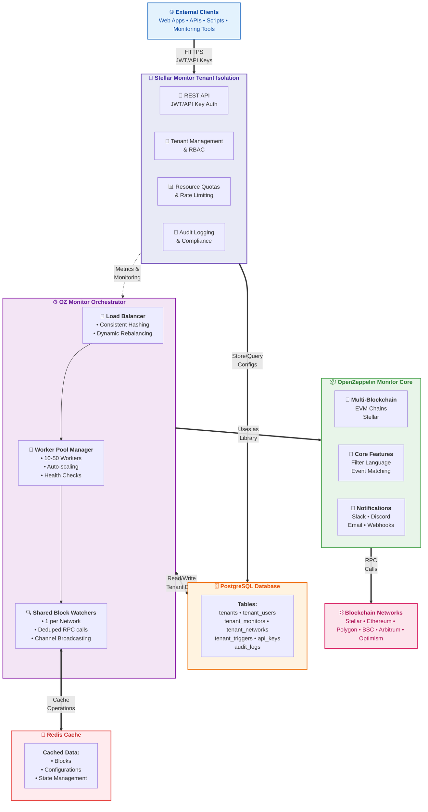

# System Architecture



## Key Architectural Principles

  1. Layered Architecture
    - API Layer: Stellar Monitor Tenant Isolation handles all external interactions
    - Orchestration Layer: OZ Monitor Orchestrator manages distributed processing
    - Core Engine: OpenZeppelin Monitor provides blockchain monitoring logic
  2. Data Flow
    - Tenant configurations stored in PostgreSQL via API layer
    - Orchestrator reads configs and distributes to workers
    - Workers use OpenZeppelin Monitor library for processing
    - Results flow back through the layers
  3. Scaling Strategy
    - Vertical Separation: Each layer scales independently
    - Horizontal Scaling: Worker pool scales 10-50 instances
    - Resource Efficiency: Single block fetch serves all tenants
  4. Multi-Tenancy Implementation
    - Database Isolation: All queries filtered by tenant_id
    - Resource Quotas: Enforced at API layer
    - Worker Distribution: Consistent hashing for tenant affinity

## Integration Mechanisms

  1. Configuration Propagation
  API → PostgreSQL → Orchestrator → Worker → OZ Monitor
  2. Block Processing Pipeline
  Blockchain → Shared Watcher → Redis → Workers → Tenant Filters
  3. Authentication Flow
  Client → JWT/API Key → Tenant Context → All Operations

## Performance Characteristics

- O(1) Block Fetching: One fetch per block regardless of tenant count
- O(n) Filter Processing: Distributed across worker pool
- Sub-second Latency: Redis caching for active data
- Linear Scalability: Add workers to handle more tenants

## Security & Isolation

- Complete Tenant Isolation: Database-level filtering
- Role-Based Access Control: Hierarchical permissions
- API Key Scoping: Fine-grained access control
- Audit Trail: All actions logged with context

## Configuration Management & Caching

### Configuration Flow

1. **Storage**: All tenant configurations stored in PostgreSQL
   - Monitor definitions with filter rules
   - Network configurations and RPC endpoints
   - Trigger definitions and scripts

2. **Loading**: Workers load configurations on startup
   - Tenant-aware repositories query PostgreSQL
   - Configurations cached in memory (`DashMap` structures)
   - No automatic refresh mechanism currently

3. **Caching Behavior**:
   - In-memory cache persists for worker lifetime
   - No TTL or invalidation mechanism
   - Configuration changes require worker restart

4. **Update Propagation**:
   - Database updates don't trigger cache refresh
   - Workers continue with cached configurations
   - See [Configuration Updates Documentation](./configuration-updates.md) for details

### Cache Architecture

```bash
PostgreSQL (Source of Truth)
    ↓ (Load on startup)
Worker Memory Cache
    - monitor_cache: DashMap<Uuid, HashMap<String, Monitor>>
    - contract_spec_cache: DashMap<String, ContractSpec>
    - trigger_script_cache: DashMap<String, String>
```

## Deployment Architecture

- Kubernetes Native: Designed for K8s deployment
- Auto-scaling: HPA based on CPU, memory, tenant count
- High Availability: Multiple replicas with pod disruption budgets
- Observability: Prometheus metrics at each layer
