# System Architecture

  ┌─────────────────────────────────────────────────────────────────────┐
  │                        External Clients                              │
  │            (Web Apps, APIs, Scripts, Monitoring Tools)              │
  └─────────────────────────────────┬───────────────────────────────────┘
                                    │ HTTPS/JWT/API Keys
                                    ▼
  ┌─────────────────────────────────────────────────────────────────────┐
  │           Stellar Monitor Tenant Isolation (API Layer)              │
  │  ┌─────────────────────────────────────────────────────────────┐   │
  │  │ • REST API with JWT/API Key Auth                            │   │
  │  │ • Tenant Management & RBAC                                  │   │
  │  │ • Resource Quotas & Rate Limiting                           │   │
  │  │ • Audit Logging & Compliance                                │   │
  │  └─────────────────────────────────────────────────────────────┘   │
  └────────────────┬─────────────────────────────┬─────────────────────┘
                   │ PostgreSQL                   │ Metrics
                   ▼                              ▼
  ┌─────────────────────────┐    ┌──────────────────────────────────────┐
  │     PostgreSQL DB       │    │     OZ Monitor Orchestrator          │
  │  ┌─────────────────┐    │    │  ┌────────────────────────────────┐  │
  │  │ • tenants       │    │    │  │ Load Balancer                  │  │
  │  │ • tenant_users  │    │◄───┤  │ • Consistent Hashing           │  │
  │  │ • tenant_monitors    │    │  │ • Dynamic Rebalancing          │  │
  │  │ • tenant_networks    │    │  └────────────┬───────────────────┘  │
  │  │ • tenant_triggers    │    │               │                      │
  │  │ • api_keys          │    │  ┌────────────▼───────────────────┐  │
  │  │ • audit_logs        │    │  │ Worker Pool Manager              │  │
  │  └─────────────────┘    │    │  │ • 10-50 Workers (Auto-scaling) │  │
  └─────────────────────────┘    │  │ • Health Checking              │  │
                                 │  │ • Config Reloading              │  │
           ┌─────────────────────┤  └────────────┬───────────────────┘  │
           │                     │               │                      │
           ▼                     │  ┌────────────▼───────────────────┐  │
  ┌─────────────────┐            │  │ Shared Block Watchers          │  │
  │   Redis Cache   │            │  │ • 1 per Network                │  │
  │ ┌─────────────┐ │            │  │ • Deduplicates RPC calls       │  │
  │ │ • Blocks    │ │◄───────────┤  │ • Broadcasts via Channels      │  │
  │ │ • Configs   │ │            │  └────────────────────────────────┘  │
  │ │ • State     │ │            └──────────────────────────────────────┘
  │ └─────────────┘ │                            │
  └─────────────────┘                            │ Uses as Library
                                                ▼
                                 ┌──────────────────────────────────────┐
                                 │    OpenZeppelin Monitor (Core)       │
                                 │  ┌────────────────────────────────┐  │
                                 │  │ • Multi-Blockchain Support     │  │
                                 │  │   - EVM Chains                 │  │
                                 │  │   - Stellar                    │  │
                                 │  │ • Filter Expression Language   │  │
                                 │  │ • Event/Function Matching      │  │
                                 │  │ • Notification System          │  │
                                 │  │   - Slack, Discord, Email      │  │
                                 │  │   - Webhooks, Scripts          │  │
                                 │  └────────────────────────────────┘  │
                                 └──────────────────────────────────────┘
                                                │
                                                ▼
                                 ┌──────────────────────────────────────┐
                                 │         Blockchain Networks          │
                                 │    (Stellar, Ethereum, Polygon...)   │
                                 └──────────────────────────────────────┘

```mermaid
flowchart TB
    %% External Layer
    Clients["🌐 <b>External Clients</b><br/>Web Apps • APIs • Scripts • Monitoring Tools"]
    
    %% API Layer
    subgraph APILayer["🔐 <b>Stellar Monitor Tenant Isolation</b>"]
        direction LR
        API1["🔑 REST API<br/>JWT/API Key Auth"]
        API2["👥 Tenant Management<br/>& RBAC"]
        API3["📊 Resource Quotas<br/>& Rate Limiting"]
        API4["📝 Audit Logging<br/>& Compliance"]
    end
    
    %% Database
    subgraph PostgreSQL["🗄️ <b>PostgreSQL Database</b>"]
        Tables["<b>Tables:</b><br/>tenants • tenant_users<br/>tenant_monitors • tenant_networks<br/>tenant_triggers • api_keys<br/>audit_logs"]
    end
    
    %% Orchestrator Components
    subgraph OrchestratorLayer["⚙️ <b>OZ Monitor Orchestrator</b>"]
        direction TB
        LoadBalancer["🔄 <b>Load Balancer</b><br/>• Consistent Hashing<br/>• Dynamic Rebalancing"]
        WorkerPool["👷 <b>Worker Pool Manager</b><br/>• 10-50 Workers<br/>• Auto-scaling<br/>• Health Checks"]
        BlockWatchers["🔍 <b>Shared Block Watchers</b><br/>• 1 per Network<br/>• Deduped RPC calls<br/>• Channel Broadcasting"]
        
        LoadBalancer --> WorkerPool
        WorkerPool --> BlockWatchers
    end
    
    %% Redis
    subgraph Redis["💾 <b>Redis Cache</b>"]
        RedisData["<b>Cached Data:</b><br/>• Blocks<br/>• Configurations<br/>• State Management"]
    end
    
    %% Core Monitor
    subgraph MonitorCore["📦 <b>OpenZeppelin Monitor Core</b>"]
        direction LR
        Core1["🔗 <b>Multi-Blockchain</b><br/>EVM Chains<br/>Stellar"]
        Core2["🎯 <b>Core Features</b><br/>Filter Language<br/>Event Matching"]
        Core3["📢 <b>Notifications</b><br/>Slack • Discord<br/>Email • Webhooks"]
    end
    
    %% Blockchains
    Chains["⛓️ <b>Blockchain Networks</b><br/>Stellar • Ethereum • Polygon • BSC • Arbitrum • Optimism"]
    
    %% Main Flow Connections
    Clients ==>|"HTTPS<br/>JWT/API Keys"| APILayer
    APILayer ==>|"Store/Query<br/>Configs"| PostgreSQL
    APILayer -.->|"Metrics &<br/>Monitoring"| OrchestratorLayer
    OrchestratorLayer <===>|"Read/Write<br/>Tenant Data"| PostgreSQL
    BlockWatchers <===>|"Cache<br/>Operations"| Redis
    OrchestratorLayer ==>|"Uses as<br/>Library"| MonitorCore
    MonitorCore ==>|"RPC<br/>Calls"| Chains
    
    %% Enhanced Styling
    classDef clientBox fill:#e3f2fd,stroke:#1565c0,stroke-width:2px,color:#0d47a1
    classDef apiBox fill:#e8eaf6,stroke:#5e35b1,stroke-width:2px,color:#4527a0
    classDef dbBox fill:#fff3e0,stroke:#ef6c00,stroke-width:2px,color:#e65100
    classDef orchestratorBox fill:#f3e5f5,stroke:#8e24aa,stroke-width:2px,color:#6a1b9a
    classDef cacheBox fill:#ffebee,stroke:#e53935,stroke-width:2px,color:#c62828
    classDef coreBox fill:#e8f5e9,stroke:#43a047,stroke-width:2px,color:#2e7d32
    classDef chainBox fill:#fce4ec,stroke:#d81b60,stroke-width:2px,color:#ad1457
    
    class Clients clientBox
    class APILayer apiBox
    class PostgreSQL dbBox
    class OrchestratorLayer orchestratorBox
    class Redis cacheBox
    class MonitorCore coreBox
    class Chains chainBox
```

## Key Architectural Principles

  1. Layered Architecture
    - API Layer: Stellar Monitor Tenant Isolation handles all external interactions
    - Orchestration Layer: OZ Monitor Orchestrator manages distributed processing
    - Core Engine: OpenZeppelin Monitor provides blockchain monitoring logic
  2. Data Flow
    - Tenant configurations stored in PostgreSQL via API layer
    - Orchestrator reads configs and distributes to workers
    - Workers use OpenZeppelin Monitor library for processing
    - Results flow back through the layers
  3. Scaling Strategy
    - Vertical Separation: Each layer scales independently
    - Horizontal Scaling: Worker pool scales 10-50 instances
    - Resource Efficiency: Single block fetch serves all tenants
  4. Multi-Tenancy Implementation
    - Database Isolation: All queries filtered by tenant_id
    - Resource Quotas: Enforced at API layer
    - Worker Distribution: Consistent hashing for tenant affinity

## Integration Mechanisms

  1. Configuration Propagation
  API → PostgreSQL → Orchestrator → Worker → OZ Monitor
  2. Block Processing Pipeline
  Blockchain → Shared Watcher → Redis → Workers → Tenant Filters
  3. Authentication Flow
  Client → JWT/API Key → Tenant Context → All Operations

## Performance Characteristics

- O(1) Block Fetching: One fetch per block regardless of tenant count
- O(n) Filter Processing: Distributed across worker pool
- Sub-second Latency: Redis caching for active data
- Linear Scalability: Add workers to handle more tenants

## Security & Isolation

- Complete Tenant Isolation: Database-level filtering
- Role-Based Access Control: Hierarchical permissions
- API Key Scoping: Fine-grained access control
- Audit Trail: All actions logged with context

## Deployment Architecture

- Kubernetes Native: Designed for K8s deployment
- Auto-scaling: HPA based on CPU, memory, tenant count
- High Availability: Multiple replicas with pod disruption budgets
- Observability: Prometheus metrics at each layer
