# Architecture Solution

Core Problem

The current OpenZeppelin monitor architecture creates one blockwatcher per network, which would lead to duplicate
block fetching if you run multiple instances. You need to decouple block ingestion from filter evaluation.

Proposed Architecture

```mermaid
flowchart TB
    subgraph BlockIngestion["📥 Block Ingestion Layer"]
        direction LR
        BI1["⛓️ Block Ingester<br/>(Ethereum)"]
        BI2["⛓️ Block Ingester<br/>(Stellar)"]
        BI3["⛓️ Block Ingester<br/>(Polygon)"]
    end
    
    MessageQueue["📨 Kafka/Pulsar<br/>Block Events"]
    
    subgraph Workers["👷 Worker Layer"]
        direction LR
        subgraph Worker1["Filter Worker Pod 1"]
            W1Config["📋 Tenant Configs<br/>(Cached)"]
        end
        subgraph Worker2["Filter Worker Pod 2"]
            W2Config["📋 Tenant Configs<br/>(Cached)"]
        end
        Worker3["... Auto-scaling ..."]
    end
    
    ResultAggregator["📊 Result Aggregator<br/>& Trigger Service"]
    
    %% Connections
    BI1 --> MessageQueue
    BI2 --> MessageQueue
    BI3 --> MessageQueue
    
    MessageQueue --> Worker1
    MessageQueue --> Worker2
    MessageQueue --> Worker3
    
    Worker1 --> ResultAggregator
    Worker2 --> ResultAggregator
    Worker3 --> ResultAggregator
    
    %% Styling
    classDef ingestionStyle fill:#e3f2fd,stroke:#1565c0,stroke-width:2px
    classDef queueStyle fill:#fff3e0,stroke:#ff6f00,stroke-width:2px
    classDef workerStyle fill:#f3e5f5,stroke:#8e24aa,stroke-width:2px
    classDef resultStyle fill:#e8f5e9,stroke:#43a047,stroke-width:2px
    
    class BI1,BI2,BI3 ingestionStyle
    class MessageQueue queueStyle
    class Worker1,Worker2,Worker3 workerStyle
    class ResultAggregator resultStyle
```



Implementation Plan

## 1. Modify OpenZeppelin Monitor - Block Publisher

Create a new block publisher mode that publishes blocks instead of processing them:

```rust
// New trait for block publishing
pub trait BlockPublisher: Send + Sync {
    async fn publish_block(&self, network: &str, block: ProcessedBlock) -> Result<()>;
}

// Kafka implementation
pub struct KafkaBlockPublisher {
    producer: FutureProducer,
    topic_prefix: String,
}

// Modified process_new_blocks function
pub async fn process_new_blocks_with_publisher<P: BlockPublisher>(
    network: &Network,
    rpc_client: &C,
    block_storage: Arc<S>,
    block_publisher: Arc<P>,
) -> Result<()> {
    // ... existing block fetching logic ...

    for block in blocks {
        let processed_block = ProcessedBlock {
            network: network.clone(),
            block_number,
            block_data: block,
            timestamp: Utc::now(),
        };

        // Publish to Kafka instead of processing filters
        block_publisher.publish_block(&network.slug, processed_block).await?;
    }
}
```

## 2. Filter Evaluation Workers

Create a new service that consumes blocks and evaluates filters:

```rust
pub struct FilterWorker {
    consumer: StreamConsumer,
    tenant_monitor_repo: Arc<TenantMonitorRepository>,
    filter_service: Arc<FilterService>,
    config_cache: Arc<RwLock<HashMap<String, Vec<MonitorConfig>>>>,
}

impl FilterWorker {
    pub async fn start(&self) {
        // Subscribe to block topics
        self.consumer.subscribe(&["blocks.*"]).await?;

        // Process blocks in parallel
        while let Some(message) = self.consumer.stream().next().await {
            let block: ProcessedBlock = deserialize(&message.payload())?;

            // Get all tenant configs for this network from cache
            let configs = self.config_cache.read().await
                .get(&block.network.slug)
                .cloned()
                .unwrap_or_default();

            // Process configs in parallel using tokio tasks
            let tasks: Vec<_> = configs.into_iter()
                .map(|config| {
                    let block = block.clone();
                    let filter_service = self.filter_service.clone();

                    tokio::spawn(async move {
                        filter_service.evaluate_filters(&block, &config).await
                    })
                })
                .collect();

            // Wait for all evaluations to complete
            futures::future::join_all(tasks).await;
        }
    }
}
```

## 3. Configuration Management

Implement efficient configuration distribution:

```rust
pub struct ConfigurationManager {
    db: Arc<PgPool>,
    redis: Arc<redis::Client>,
}

impl ConfigurationManager {
    // Listen for database changes and update Redis
    pub async fn start_sync(&self) {
        let mut listener = PgListener::connect_with(&self.db).await?;
        listener.listen("config_changes").await?;

        while let Some(notification) = listener.recv().await? {
            let change: ConfigChange = serde_json::from_str(&notification.payload())?;

            // Update Redis cache
            let configs = self.load_tenant_configs(&change.network_slug).await?;
            self.redis.set(
                &format!("configs:{}", change.network_slug),
                serde_json::to_string(&configs)?,
            ).await?;

            // Publish update event
            self.redis.publish(
                "config_updates",
                &change.network_slug,
            ).await?;
        }
    }
}
```

## 4. Kubernetes Deployment

Deploy with Kubernetes for orchestration and auto-scaling:

## Block Ingester Deployment (one per network)

```yaml
apiVersion: apps/v1
kind: Deployment
metadata:
name: block-ingester-ethereum
spec:
replicas: 1  # Only one per network
template:
    spec:
    containers:
    - name: ingester
        image: openzeppelin-monitor:publisher
        env:
        - name: MODE
        value: "publisher"
        - name: NETWORK
        value: "ethereum"
        - name: KAFKA_BROKERS
        value: "kafka:9092"
        resources:
        requests:
            memory: "512Mi"
            cpu: "250m"
```

---

## Filter Worker Deployment (auto-scaling)

```yaml
apiVersion: apps/v1
kind: Deployment
metadata:
name: filter-workers
spec:
replicas: 3
template:
    spec:
    containers:
    - name: worker
        image: filter-worker:latest
        env:
        - name: KAFKA_BROKERS
        value: "kafka:9092"
        - name: REDIS_URL
        value: "redis://redis:6379"
        resources:
        requests:
            memory: "1Gi"
            cpu: "500m"
        limits:
            memory: "2Gi"
            cpu: "1000m"
```

---

## Horizontal Pod Autoscaler

```yaml
apiVersion: autoscaling/v2
kind: HorizontalPodAutoscaler
metadata:
name: filter-worker-hpa
spec:
scaleTargetRef:
    apiVersion: apps/v1
    kind: Deployment
    name: filter-workers
minReplicas: 3
maxReplicas: 50
metrics:
- type: Resource
    resource:
    name: cpu
    target:
        type: Utilization
        averageUtilization: 70
- type: External
    external:
    metric:
        name: kafka_consumer_lag
    target:
        type: Value
        value: "1000"
```

## 5. Performance Optimizations

1. Batch Processing: Process multiple tenant configs per block in parallel
2. Caching Strategy:
    - Redis for hot configurations
    - Local memory cache with TTL
    - Pre-fetch configurations for active networks
3. Connection Pooling: Reuse RPC connections across workers
4. Circuit Breakers: Handle RPC failures gracefully

### Benefits of This Architecture

1. Linear Scaling: Block fetching is O(1) per network, filter evaluation scales horizontally
2. Zero Downtime: Rolling updates, health checks, graceful shutdowns
3. Fault Tolerance: Kafka ensures no block is lost, consumer groups handle worker failures
4. Cost Efficiency: Only fetch each block once per network
5. Flexibility: Can scale different components independently

### Alternative: Message Queue Patterns

If you prefer not to modify OpenZeppelin monitor, you could use a proxy pattern:

1. RPC Proxy Layer: Intercept and cache RPC calls
2. Shared Block Cache: Redis-based block cache across instances
3. Coordination Service: Elect leader per network for block fetching

## Multi-Tenant Monitor Orchestration Plan

### Architecture Overview

Implement a distributed event-driven architecture that separates block ingestion from filter evaluation to
achieve horizontal scaling and zero downtime.

#### Phase 1: Core Infrastructure Setup

1. Message Queue Infrastructure

    - Deploy Kafka/Pulsar cluster for block event streaming
    - Configure topics per network (e.g., blocks.ethereum, blocks.stellar)
    - Set up proper partitioning for parallel processing

2. Caching Layer

    - Deploy Redis cluster for configuration caching
    - Implement pub/sub for real-time config updates
    - Set up connection pooling

3. Kubernetes Setup

    - Configure namespace with resource quotas
    - Set up service mesh (Istio/Linkerd) for observability
    - Deploy monitoring stack (Prometheus, Grafana)

#### Phase 2: Modify OpenZeppelin Monitor

1. Create Block Publisher Module

    - Add new BlockPublisher trait for publishing blocks to Kafka
    - Modify process_new_blocks to support publisher mode
    - Add configuration for publisher vs. processor mode

2. Block Ingester Service

    - One instance per network (no duplication)
    - Publishes ProcessedBlock structs to Kafka
    - Maintains block storage and tracking

#### Phase 3: Build Filter Evaluation Workers

1. Filter Worker Service

    - Consumes blocks from Kafka using consumer groups
    - Loads tenant configurations from cache
    - Evaluates filters in parallel using Tokio tasks
    - Publishes results to result aggregation service

2. Configuration Sync Service

    - Listens to PostgreSQL NOTIFY events
    - Updates Redis cache on configuration changes
    - Broadcasts updates to workers via Redis pub/sub

#### Phase 4: Deployment and Scaling

1. Kubernetes Deployments

    - Block Ingesters: 1 replica per network
    - Filter Workers: 3-50 replicas with HPA
    - Config Manager: 2 replicas for HA
    - Result Aggregator: 3 replicas

2. Auto-scaling Configuration

    - CPU-based scaling (70% threshold)
    - Kafka lag-based scaling
    - Memory-based scaling for filter workers

#### Phase 5: Monitoring and Optimization

1. Performance Metrics

    - Block processing latency
    - Filter evaluation throughput
    - Queue depth and consumer lag
    - Resource utilization per tenant

2. Optimization

    - Implement batch processing for filters
    - Add circuit breakers for RPC calls
    - Optimize filter evaluation with caching
    - Implement connection pooling for RPC clients

This architecture ensures:

- Blocks are fetched only once per network
- Filter evaluation scales horizontally with load
- Zero downtime with rolling updates
- Sub-linear scaling as users grow
- Fault tolerance with message queue persistence
